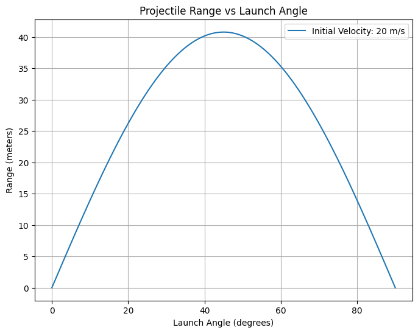

# Problem 1
# Projectile Motion Analysis

## Theoretical Foundation
Projectile motion follows Newton’s laws and can be described by kinematic equations. The horizontal and vertical motions are independent, governed by the equations:

$$ x = v_0 \cos(\theta) t $$

$$ y = h + v_0 \sin(\theta) t - \frac{1}{2} g t^2 $$

Solving for the range when \( y = 0 \), we obtain:

$$ R = \frac{v_0^2 \sin(2\theta)}{g} $$

## Implementation in Python
The following Python script simulates projectile motion and visualizes the range vs. launch angle.

## Observations
- The range is maximized at **$\theta = 45^\circ$**, as seen in the graph.
- Increasing initial velocity **$v_0$** extends the range.
- If the projectile is launched from a height **$h > 0$**, the time of flight increases, affecting the range.

## Limitations and Extensions
- Air resistance is neglected in this idealized model.
- Future extensions can include drag force and wind effects, making the model more realistic.

$$ F_d = \frac{1}{2} C_d \rho A v^2 $$

This provides a solid foundation for understanding projectile motion across various domains.

