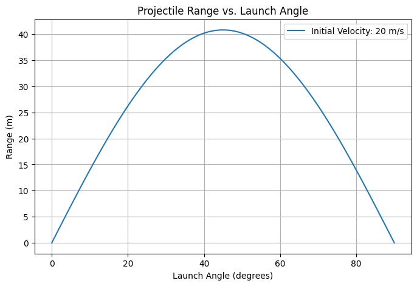
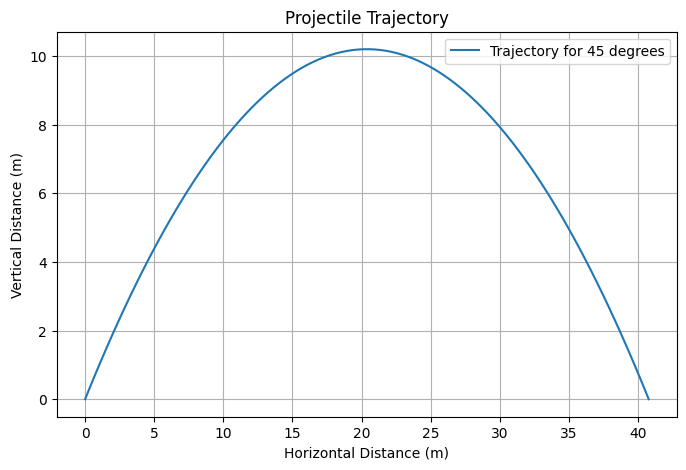
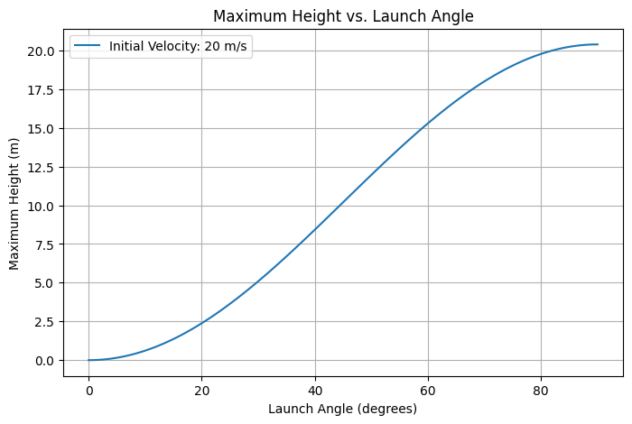

# Projectile Motion: A Detailed Exploration

## 1. Theoretical Foundation

Projectile motion describes the motion of an object under the influence of gravity, assuming no air resistance. The motion can be analyzed by decomposing it into horizontal and vertical components. This type of motion is governed by kinematic equations and provides fundamental insights into physics and engineering applications.

### 1.1 Governing Equations
The equations of motion follow from Newton's second law:

$$ F = ma $$

For projectile motion in two dimensions:

- **Horizontal motion (constant velocity):**
  $$ x(t) = v_0 \cos(\theta) t $$
  
- **Vertical motion (accelerated motion due to gravity):**
  $$ y(t) = v_0 \sin(\theta) t - \frac{1}{2} g t^2 $$
  
where:

- $$ v_0 $$ is the initial velocity,

- $$ \theta $$ is the launch angle,

- $$ g $$ is the acceleration due to gravity,

- $$ t $$ is the time elapsed.

The velocity components at any time $ t $ are:

$$ v_x = v_0 \cos(\theta) $$
$$ v_y = v_0 \sin(\theta) - g t $$

### 1.2 Time of Flight
The time when the projectile reaches the ground is found by setting $ y = 0 $:

$$ t_f = \frac{2 v_0 \sin(\theta)}{g} $$

This equation provides insight into how the initial speed and angle affect the duration of flight.

### 1.3 Range of the Projectile
The horizontal range is given by:

$$ R = v_0 \cos(\theta) t_f = \frac{v_0^2 \sin(2\theta)}{g} $$

This equation shows that the maximum range occurs at $ \theta = 45^\circ $ and is directly proportional to the square of the initial velocity.

### 1.4 Maximum Height
The highest point $ y_{max} $ is found when $ v_y = 0 $:

$$ y_{max} = \frac{v_0^2 \sin^2(\theta)}{2g} $$

This formula helps determine the peak altitude reached by the projectile.

## 2. Analysis of Range Dependence

### 2.1 Effect of Launch Angle
- The range follows a sinusoidal relationship, peaking at $ 45^\circ $.
- Complementary angles ($ \theta $ and $ 90^\circ - \theta $) yield the same range.

### 2.2 Effect of Initial Velocity
- Range increases quadratically with initial speed.
- A higher initial velocity results in a longer trajectory and increased maximum height.

### 2.3 Effect of Gravity
- Stronger gravity shortens both range and time of flight.
- On celestial bodies with lower gravity (e.g., the Moon), projectiles travel much farther.

### 2.4 Effect of Launch Height
- A projectile launched from an elevated position stays airborne longer, extending its range.
- The additional term for height in the range equation introduces asymmetry in the trajectory.

## 3. Practical Applications

### 3.1 Sports
- Ballistics in football, basketball, and golf.
- Optimizing angles for maximum distance or height.

### 3.2 Engineering and Ballistics
- Missile trajectory calculations.
- Design of artillery and projectile-based defense systems.

### 3.3 Space Science
- Rocket launches and planetary landings.
- Escape velocity and orbital mechanics calculations.

## 4. Implementation in Python

Below is a Python script that simulates projectile motion and plots various aspects of the motion:

### 4.1 Range vs. Launch Angle

### 4.2 Projectile Trajectory Simulation

### 4.3 Maximum Height vs. Launch Angle

### 4.4 Extending the Simulation
- Modify the code to include different gravitational accelerations.
- Introduce air resistance for a more realistic trajectory.
- Simulate varying launch heights.

## 5. Limitations and Extensions

### 5.1 Assumptions in the Ideal Model
- **Neglecting Air Resistance:** In reality, drag alters the trajectory.
- **Ignoring Wind Effects:** Crosswinds and tailwinds significantly impact real-world projectile motion.
- **Constant Gravity:** Gravity slightly varies with altitude, especially in high-altitude launches.

### 5.2 Advanced Considerations
- **Numerical Simulations:** Solving differential equations for motion with drag.
- **Uneven Terrain:** Adjusting the impact location based on varying elevation.
- **Multi-Stage Projectiles:** Studying objects with varying thrust and mass changes (e.g., rockets).

This Markdown document serves as a comprehensive introduction to projectile motion, its equations, analysis, and Python simulation. It also provides avenues for further research and computational modeling in real-world applications.
