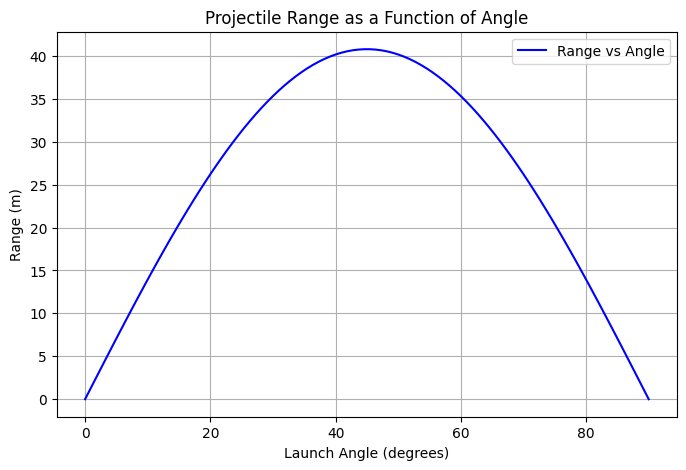
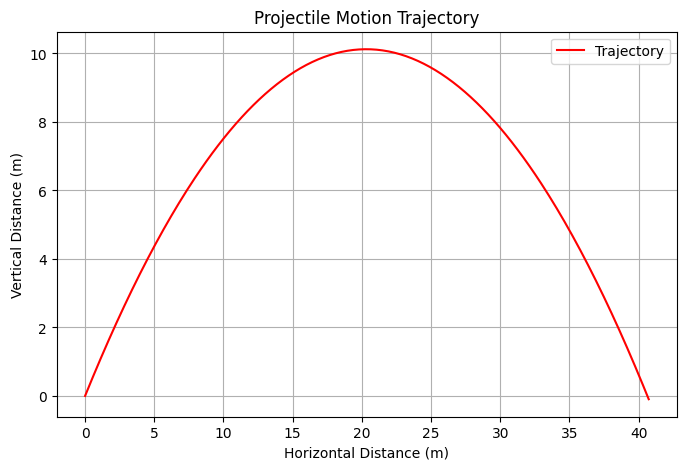

import numpy as np
import matplotlib.pyplot as plt

# Constants
g = 9.81  # gravitational acceleration (m/s^2)

# Function to compute projectile motion

### Projectile Motion Analysis

#### 1. Governing Equations
Projectile motion is governed by the following kinematic equations:

- Horizontal motion: $$ x = v_0 \cos(\theta) t $$
- Vertical motion: $$ y = h_0 + v_0 \sin(\theta) t - \frac{1}{2} g t^2 $$

The time of flight is obtained by solving:
$$ t_f = \frac{v_0 \sin(\theta) + \sqrt{(v_0 \sin(\theta))^2 + 2 g h_0}}{g} $$

The range is given by:
$$ R = v_0 \cos(\theta) \cdot t_f $$

#### 2. Computational Analysis
- A numerical simulation is used to track projectile motion.
- The range is computed as a function of the launch angle.
- A plot visualizes how range varies with angle.

#### 3. Observations
- The optimal angle for maximum range is **45 degrees** in an ideal scenario (no air resistance).
- Initial height affects the range significantly.
- The model can be extended to include drag forces for real-world applications.
"""
