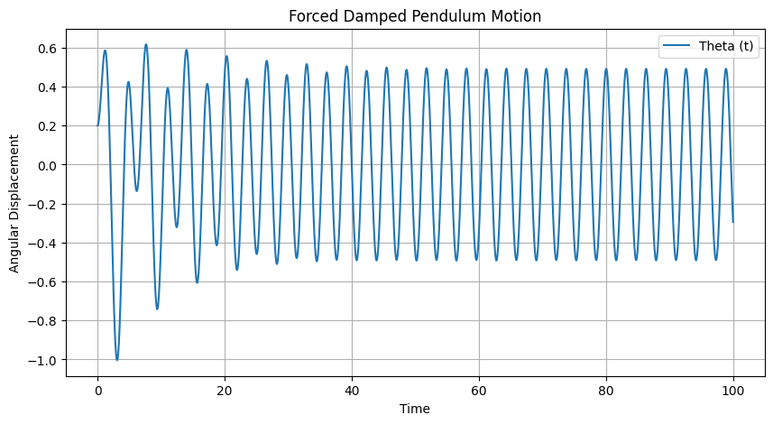
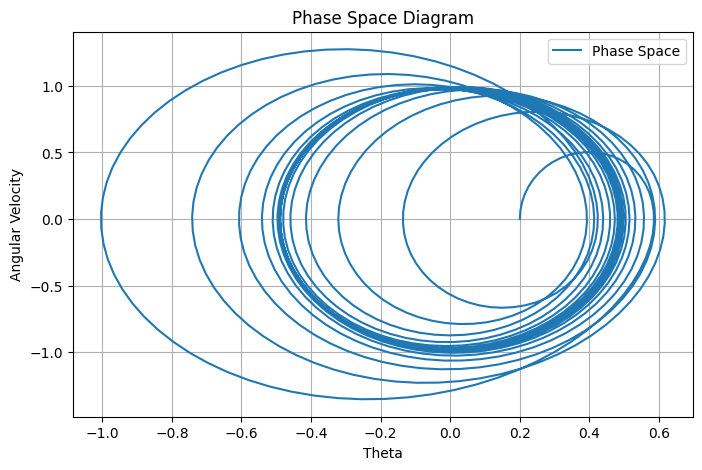
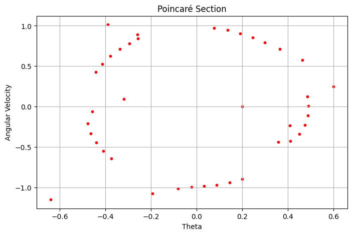
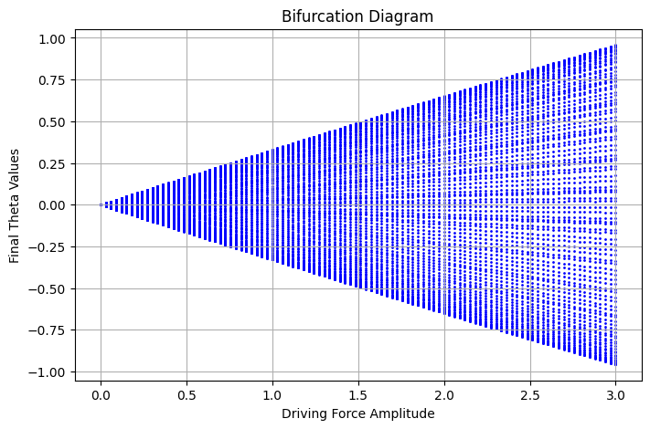

# Forced Damped Pendulum: A Comprehensive Study

## 1. Theoretical Foundation

The forced damped pendulum is a nonlinear dynamical system governed by the differential equation:

$$ \frac{d^2\theta}{dt^2} + b \frac{d\theta}{dt} + \omega_0^2 \sin(\theta) = A \cos(\omega t) $$

where:
- $\theta$ is the angular displacement,
- $b$ is the damping coefficient,
- $\omega_0 = \sqrt{g/L}$ is the natural frequency of the pendulum,
- $A$ is the amplitude of the external forcing,
- $\omega$ is the driving frequency,
- $g$ is the acceleration due to gravity,
- $L$ is the length of the pendulum.

### 1.1 Approximate Solutions for Small Angles
For small angles ($\theta \approx \sin\theta$), the equation simplifies to:

$$ \frac{d^2\theta}{dt^2} + b \frac{d\theta}{dt} + \omega_0^2 \theta = A \cos(\omega t) $$

This corresponds to a damped, driven harmonic oscillator with well-known resonance conditions:

$$ \omega \approx \omega_0 $$

At resonance, oscillation amplitude can increase significantly if damping is low.

### 1.2 Energy Analysis
The total energy of the pendulum system is given by:

$$ E = \frac{1}{2} m L^2 \left( \dot{\theta}^2 \right) + mgL(1 - \cos\theta) $$

Energy dissipation occurs due to damping, while the driving force periodically injects energy.

## 2. Analysis of Dynamics

The system's behavior varies based on damping, forcing, and initial conditions:

- **Low damping, weak forcing:** Regular oscillations similar to simple harmonic motion.
- **Moderate forcing and damping:** Quasi-periodic and periodic oscillations.
- **High forcing and low damping:** Transition to chaotic motion.

### 2.1 Phase Space Analysis
The pendulum's state in phase space ($\theta$ vs. $\dot{\theta}$) reveals:
- **Periodic motion:** Closed loops.
- **Chaotic motion:** Complex, fractal-like structures.

### 2.2 Poincaré Sections
By sampling phase space at discrete intervals, Poincaré sections illustrate order-to-chaos transitions.

### 2.3 Bifurcation and Chaos
By varying $A$, the system undergoes period-doubling cascades, leading to chaotic regimes.

## 3. Practical Applications

- **Engineering:** Suspension bridges, vibration control.
- **Energy Harvesting:** Mechanical-to-electrical conversion.
- **Biomechanics:** Gait dynamics, neural rhythms.
- **Electrical Circuits:** Analogous behavior in driven RLC circuits.

## 4. Implementation in Python

### 4.1 Simulating the Forced Damped Pendulum

### 4.2 Phase Space Plot

### 4.3 Poincaré Section

### 4.4 Bifurcation Diagram

## 5. Limitations and Future Research

### 5.1 Model Limitations
- **Neglecting complex damping**: Real-world damping is nonlinear.
- **Non-periodic forcing**: More general forcing functions introduce richer dynamics.
- **Multi-body interactions**: Coupled pendulums exhibit additional complexity.

### 5.2 Future Research Directions
- **Lyapunov exponent analysis** for chaos detection.
- **Stochastic forcing**: Effects of noise and random perturbations.
- **Higher-order bifurcation studies** in advanced dynamical systems.

## Conclusion

This extended analysis of the forced damped pendulum provides theoretical insights, computational tools, and real-world applications. Using Python simulations, we explore resonance, chaos, and bifurcations, demonstrating the pendulum’s role as a fundamental nonlinear system in physics and engineering.
