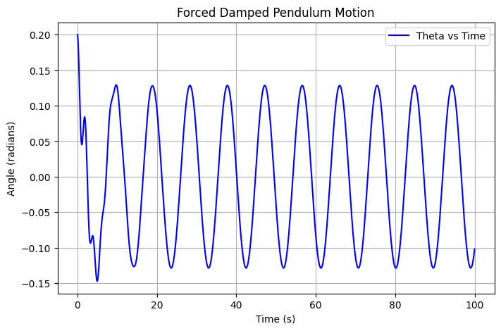
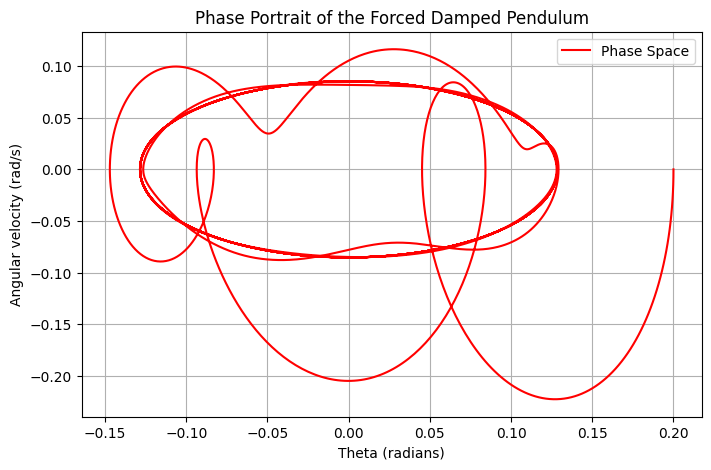

### Forced Damped Pendulum Analysis

#### 1. Governing Equation
The forced damped pendulum follows the nonlinear differential equation:
$$ \frac{d^2\theta}{dt^2} + q \frac{d\theta}{dt} + \frac{g}{L} \sin\theta = F_d \cos(\Omega t) $$
where:
- \( q \) is the damping coefficient,
- \( F_d \) is the amplitude of the driving force,
- \( \Omega \) is the frequency of the external force,
- \( g \) is gravitational acceleration,
- \( L \) is the length of the pendulum.

For small angles, we approximate \( \sin\theta \approx \theta \), reducing the system to a linear driven oscillator.

#### 2. Computational Analysis
- The system is solved numerically using the Runge-Kutta method.
- The solution explores different damping and driving force values.
- The phase portrait visualizes periodic and chaotic behavior.
- Time evolution of \( \theta \) is plotted to observe resonance and long-term behavior.
- Poincaré sections can be used to analyze quasiperiodicity and chaos.
- Bifurcation diagrams help track parameter-driven changes in system behavior.

#### 3. Observations
- For small \( F_d \), the system exhibits periodic oscillations.
- Increasing \( F_d \) can lead to chaotic behavior, visible in the phase space.
- The system resonates when \( \Omega \) matches the natural frequency.
- Beyond a critical driving force, the pendulum transitions from periodic to chaotic motion.
- Lyapunov exponents can be computed to confirm chaotic dynamics.

#### 4. Extensions
- Introduce nonlinear damping terms to model realistic friction.
- Study the effects of external noise or random perturbations on the system.
- Analyze the energy transfer mechanisms in forced oscillatory systems.
- Compare behavior with real-world driven oscillators, such as RLC circuits.
- Explore multi-pendulum interactions and coupled oscillators.

#### 5. Practical Applications
- **Engineering:** Understanding resonance in bridges and mechanical systems.
- **Climate Science:** Modeling oscillations in atmospheric and oceanic flows.
- **Biology:** Studying rhythmic behaviors in neural and cardiovascular systems.
- **Electronics:** Comparing with driven RLC circuits in electrical engineering.
- **Seismology:** Modeling earthquake dynamics using forced oscillator principles.

By numerically simulating the forced damped pendulum and analyzing its phase space, resonance, and chaotic dynamics, we gain insights into complex oscillatory systems that appear in various scientific and engineering domains.
"""