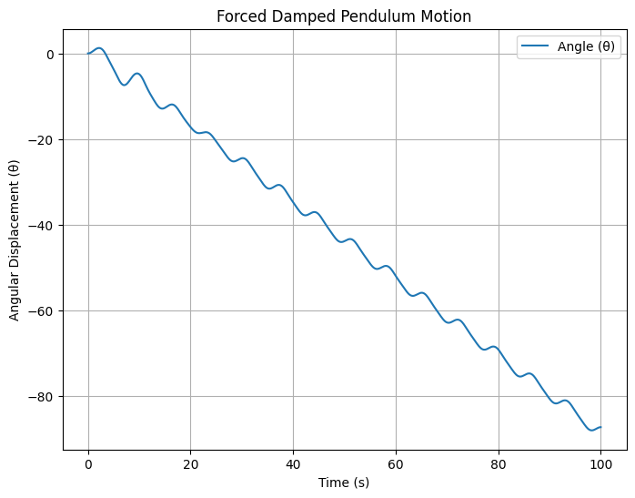

# Problem 2
# Forced Damped Pendulum Analysis

## Theoretical Foundation
The motion of a forced damped pendulum is governed by the equation:

$$ \frac{d^2\theta}{dt^2} + b \frac{d\theta}{dt} + \omega_0^2 \sin\theta = A \cos(\omega t) $$

where:
- \(\theta\) is the angular displacement,
- \(b\) is the damping coefficient,
- \(\omega_0\) is the natural frequency,
- \(A\) is the amplitude of the external driving force,
- \(\omega\) is the driving frequency.

For small angles, we approximate \( \sin\theta \approx \theta \), reducing the equation to a linear form:

$$ \frac{d^2\theta}{dt^2} + b \frac{d\theta}{dt} + \omega_0^2 \theta = A \cos(\omega t) $$

This linearized form allows for analytical solutions describing resonance and energy transfer within the system.

### Resonance Condition
The system exhibits resonance when the driving frequency \(\omega\) is close to the natural frequency \(\omega_0\), leading to large amplitude oscillations.

## Implementation in Python
The following Python script simulates the motion of a forced damped pendulum using numerical methods.

## Observations
- When the damping is low and the driving frequency matches \(\omega_0\), resonance occurs, leading to large oscillations.
- As damping increases, oscillations decay, reducing amplitude.
- For certain parameter values, chaotic motion emerges, leading to irregular trajectories.

## Advanced Analysis
- **Phase Portraits:** Visualizing \(\theta\) vs. \(\dot{\theta}\) reveals periodic, quasiperiodic, or chaotic behavior.
- **Poincaré Sections:** Stroboscopic sampling helps identify periodicity and chaos.
- **Bifurcation Diagrams:** Mapping steady-state solutions as parameters vary provides insights into chaotic transitions.

## Limitations and Extensions
- The model assumes a sinusoidal driving force; real-world systems may have non-periodic inputs.
- Air resistance and nonlinear damping effects are not included.
- Numerical solutions depend on step size and integration method precision.

## Applications
The forced damped pendulum model is relevant in:
- **Engineering:** Suspension bridges and mechanical resonance.
- **Physics:** Driven RLC circuits.
- **Biomechanics:** Human gait and balance control.

This exploration bridges theory with computation, providing insights into nonlinear dynamics and chaos theory.
