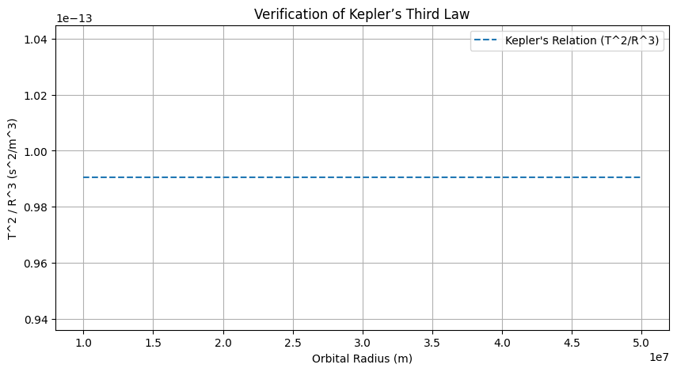
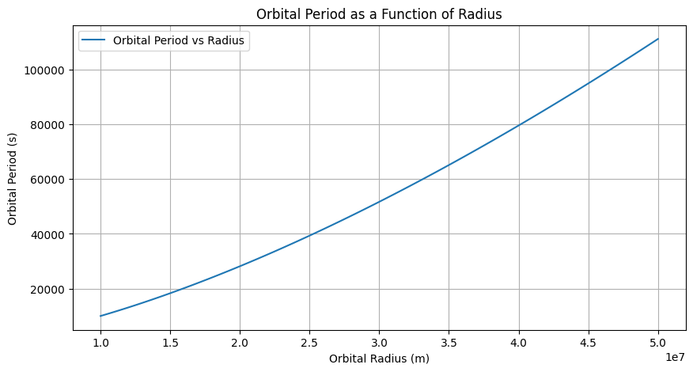
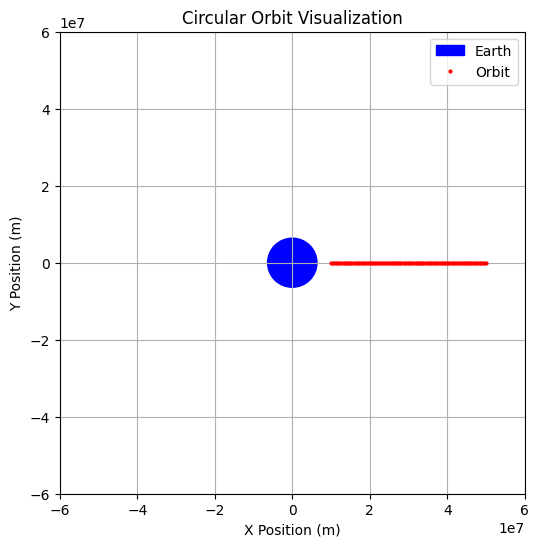

# Problem 1
## Orbital Period and Orbital Radius

### Motivation
Kepler's Third Law states that the square of a planet's orbital period is proportional to the cube of its semi-major axis (orbital radius in circular orbits). This relationship is fundamental in celestial mechanics, helping astronomers determine planetary motions and gravitational interactions. Understanding this law allows us to predict satellite orbits, planetary system behavior, and even exoplanetary systems.

### Kepler’s Third Law Derivation
For a circular orbit, the centripetal force required to maintain motion is provided by gravitational attraction:

$$  F_c = \frac{m v^2}{r}  $$
$$ F_g = \frac{G M m}{r^2} $$

Equating these forces:

$$ \frac{m v^2}{r} = \frac{G M m}{r^2} $$

Since velocity $  v  $ is given by:

$$ v = \frac{2 \pi r}{T} $$

Substituting $ v $ in the equation:

$$ \frac{m (4 \pi^2 r^2)}{T^2 r} = \frac{G M m}{r^2} $$

Canceling $ m $ and rearranging:

$$ T^2 = \frac{4 \pi^2 r^3}{G M} $$

This confirms Kepler’s Third Law:

$$ T^2 \propto r^3 $$

where $ G $ is the gravitational constant, $ M $ is the central body’s mass, $ T $ is the orbital period, and $ r $ is the orbital radius.

### Implications in Astronomy
- Used to calculate planetary masses and distances.
- Helps determine exoplanet properties.
- Crucial for spacecraft mission planning and satellite deployment.

### Real-World Examples
1. **Moon's Orbit Around Earth**
   - Given Earth’s mass ($ 5.972 \times 10^{24} $ kg) and the Moon’s average orbital radius ($ 3.84 \times 10^8 $ m), Kepler’s Law predicts the Moon’s orbital period correctly (~27.3 days).
2. **Planets in the Solar System**
   - The relationship holds true for all planets orbiting the Sun, reinforcing its universal applicability.

### Computational Model in Python
The following Python script simulates circular orbits and verifies Kepler’s Third Law graphically.

]![alt !

### Extension to Elliptical Orbits
Kepler’s Third Law extends to elliptical orbits, where the semi-major axis replaces the orbital radius:

$$ T^2 \propto a^3 $$

This generalization helps describe non-circular planetary orbits and spacecraft trajectories.

### Conclusion
Kepler’s Third Law remains a powerful tool in celestial mechanics, aiding in planetary studies, exoplanet discovery, and space mission design. Its mathematical elegance bridges theoretical physics and real-world applications.