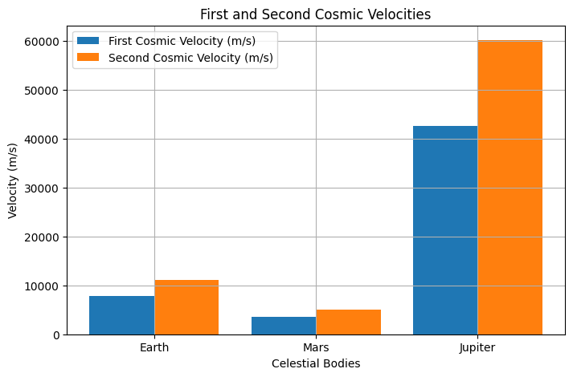

# Problem 2
## Escape Velocities and Cosmic Velocities

### Motivation
The concept of escape velocity is crucial for understanding the conditions required to leave a celestial body's gravitational influence. Extending this concept, the first, second, and third cosmic velocities define the thresholds for orbiting, escaping, and leaving a star system. These principles underpin modern space exploration, from launching satellites to interplanetary missions.

### Cosmic Velocities Definitions
1. **First Cosmic Velocity (Orbital Velocity):**

   - The minimum velocity required to maintain a stable circular orbit around a celestial body.
   - Given by:
     $$ v_1 = \sqrt{\frac{GM}{R}} $$
   - Where $G$ is the gravitational constant, $M$ is the mass of the celestial body, and $R$ is its radius.
   - This velocity ensures that the centrifugal force due to orbital motion balances the gravitational pull.

2. **Second Cosmic Velocity (Escape Velocity):**

   - The minimum velocity required to escape a celestial body's gravitational pull without further propulsion.
   - Derived from energy conservation:
     $$ v_2 = \sqrt{\frac{2GM}{R}} $$
   - This is $\sqrt{2}$ times the first cosmic velocity.
   - At this velocity, the kinetic energy equals the gravitational potential energy, allowing the object to escape indefinitely.

3. **Third Cosmic Velocity (Solar System Escape Velocity:**

   - The velocity required to escape the gravitational influence of the entire solar system.
   - It depends on the escape velocity from Earth and the Sun’s influence:
     $$ v_3 = \sqrt{v_2^2 + v_{esc,\odot}^2} $$
   - Where $v_{esc,\odot}$ is the escape velocity from the Sun.
   - This is crucial for interstellar missions and deep space exploration.

### Mathematical Derivation

To derive the escape velocity, consider the conservation of energy:

$$ \text{Total Energy} = \text{Kinetic Energy} + \text{Gravitational Potential Energy} $$

$$ \frac{1}{2} m v^2 - \frac{GMm}{R} = 0 $$

Solving for $v$:

$$ v = \sqrt{\frac{2GM}{R}} $$

This equation applies to any celestial body, with variations in mass and radius affecting the velocity required for escape.

### Computational Analysis
The following Python script calculates and visualizes these velocities for Earth, Mars, and Jupiter.

### Importance in Space Exploration
- **Satellites & Space Stations:**
  - The first cosmic velocity is crucial for placing satellites in stable orbits. The International Space Station (ISS) orbits Earth at approximately 7.66 km/s.
- **Lunar & Interplanetary Missions:**
  - The second cosmic velocity is essential for missions to the Moon, Mars, and beyond. Apollo missions had to exceed Earth's escape velocity to reach the Moon.
- **Interstellar Travel:**
  - The third cosmic velocity is relevant for long-term space exploration. Probes like Voyager 1 and 2 have achieved solar system escape velocity and are currently traveling into interstellar space.

### Conclusion
Escape and cosmic velocities define fundamental thresholds in celestial mechanics, guiding modern space exploration efforts. Understanding these principles allows for more efficient mission planning and technological advancements in space travel. They provide the foundation for future endeavors, including planetary colonization and interstellar exploration.
