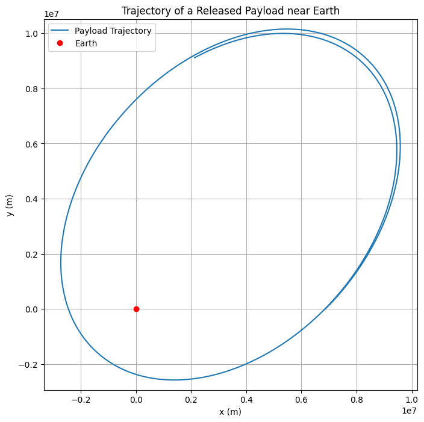
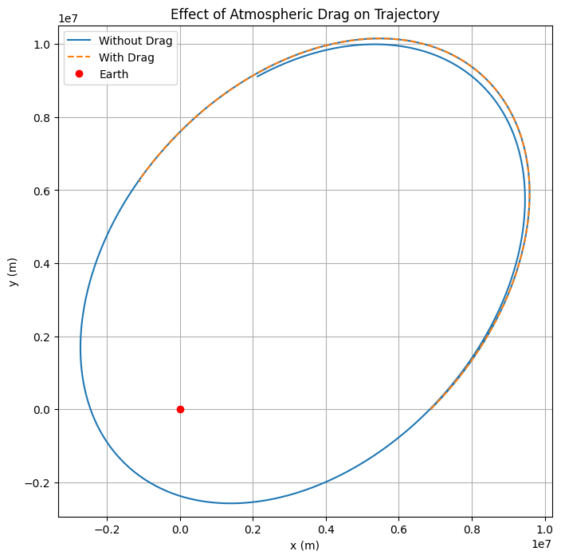

# Problem 3
# Trajectories of a Freely Released Payload Near Earth

## Motivation
When a payload is released from a moving spacecraft near Earth, its trajectory is influenced by its initial velocity and the gravitational pull of Earth. Understanding these trajectories is crucial for various space missions, including satellite deployment, reentry planning, and interplanetary travel. This study aims to analyze possible trajectories, simulate them numerically, and visualize the results.

## Governing Equations
The motion of the payload is governed by Newton's Law of Gravitation and Newton's Second Law of Motion:

$$ F = \frac{G M_{earth} m}{r^2} $$

where:

- $G$ is the gravitational constant ($6.67430 \times 10^{-11}$ m³/kg/s²),
- $M_{earth}$ is Earth's mass ($5.972 \times 10^{24}$ kg),
- $r$ is the radial distance from Earth's center,
- $m$ is the mass of the payload.

Using Newton’s Second Law ($ F = ma $), we derive the equations of motion in two-dimensional Cartesian coordinates:

$$ a_x = -\frac{G M_{earth} x}{r^3}, \quad a_y = -\frac{G M_{earth} y}{r^3} $$

where $ (x, y) $ represents the position of the payload.

## Types of Possible Trajectories
- **Circular Orbit**: If the velocity of the payload is precisely the orbital velocity for its altitude, it will move in a circular orbit around Earth.
- **Elliptical Orbit**: When the velocity is below escape velocity but not equal to circular velocity, the payload follows an elliptical orbit.
- **Parabolic Trajectory**: If the payload’s velocity is exactly equal to escape velocity ($ v_{esc} = \sqrt{2 G M_{earth} / r} $), it will follow a parabolic trajectory, escaping Earth's gravity.
- **Hyperbolic Trajectory**: If the velocity exceeds escape velocity, the payload follows a hyperbolic trajectory and escapes Earth's gravitational influence completely.
- **Suborbital Trajectory**: If the velocity is too low, the payload will follow a ballistic trajectory and reenter Earth's atmosphere.

## Numerical Simulation
We employ the Runge-Kutta method to integrate these equations and determine the payload's trajectory.

### Python Implementation


## Additional Simulations

### Effect of Atmospheric Drag


## Conclusion
By simulating the motion of a payload released near Earth, we gain insights into orbital mechanics and space mission design. This study provides a computational approach to predicting different possible trajectories based on initial conditions. Further analysis can incorporate atmospheric drag, gravitational perturbations, and interactions with other celestial bodies.
```
