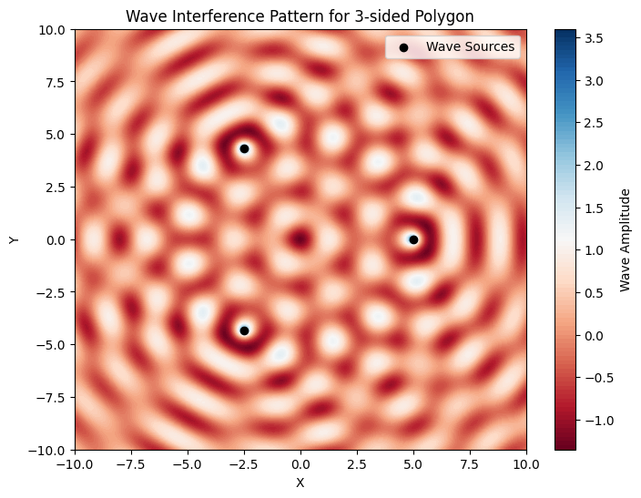
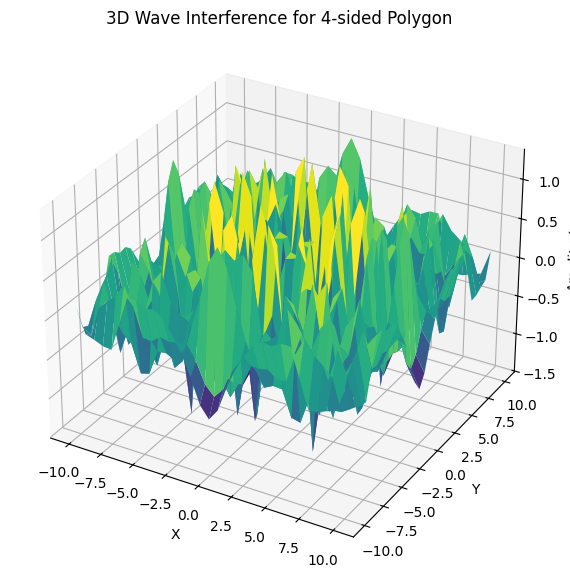
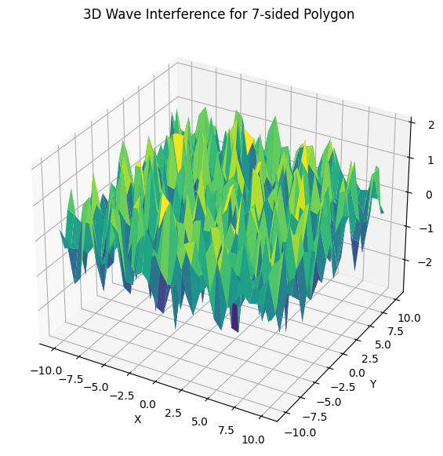

# Problem 1
# Wave Interference Simulation

## Introduction
Interference occurs when waves from different sources overlap, forming unique patterns. On a water surface, this can be seen when ripples from different points meet, creating interference patterns. Understanding these patterns helps in visualizing wave behavior and the principles of constructive and destructive interference.

## Problem Statement
We aim to analyze interference patterns formed due to the superposition of waves emitted from point sources arranged at the vertices of a chosen regular polygon. This will provide insights into wave interactions and phase relationships.

## Mathematical Model
A circular wave from a point source at $(x_0, y_0)$ can be described by the Single Disturbance equation:

$$
\eta(x, y, t) = \frac{A}{\sqrt{r}} \cos (kr - \omega t + \phi) 
$$

where:
- $\eta(x, y, t)$ is the displacement of the water surface at point $(x, y)$ and time $t$,
- $A$ is the wave amplitude,
- $k = \frac{2\pi}{\lambda}$ is the wave number,
- $\omega = 2\pi f$ is the angular frequency,
- $r = \sqrt{(x - x_0)^2 + (y - y_0)^2}$ is the distance from the source,
- $\phi$ is the initial phase.

For multiple wave sources, the total displacement at any point is given by the superposition principle:

$$
\eta_{sum}(x, y, t) = \sum_{i=1}^{N} \eta_i(x, y, t) 
$$

where $N$ is the number of sources.

## Implementation in Python
We use Python with Matplotlib and NumPy to simulate wave interference patterns. The approach includes:
1. Choosing a regular polygon (triangle, square, pentagon, etc.).
2. Placing wave sources at its vertices.
3. Calculating the resultant wave field by summing individual waves.
4. Visualizing the interference pattern.

## Results and Observations
- Different polygons produce distinct interference patterns.
- Regions of constructive interference (bright spots) and destructive interference (dark spots) are clearly visible.
- Increasing the number of sources leads to more complex patterns.
- A 3D visualization gives a more intuitive understanding of amplitude variations.

## Conclusion
This simulation helps in understanding wave superposition in a visually intuitive way. The principle extends to many physical phenomena, including optics, acoustics, and quantum mechanics.
