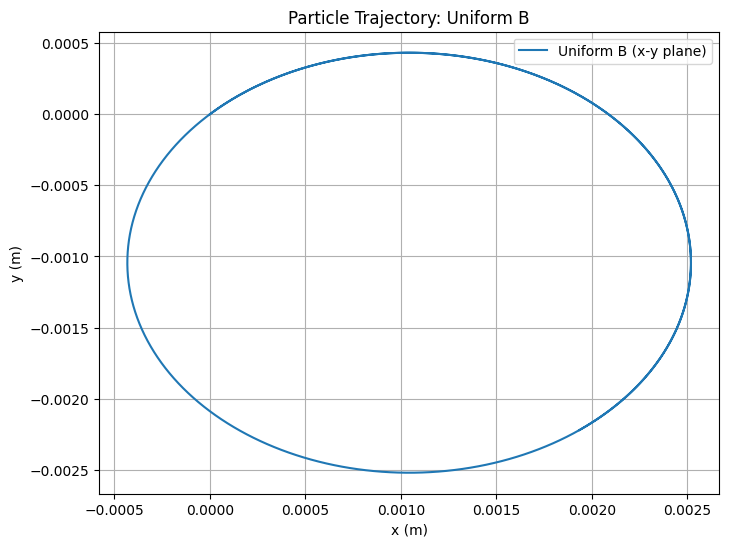
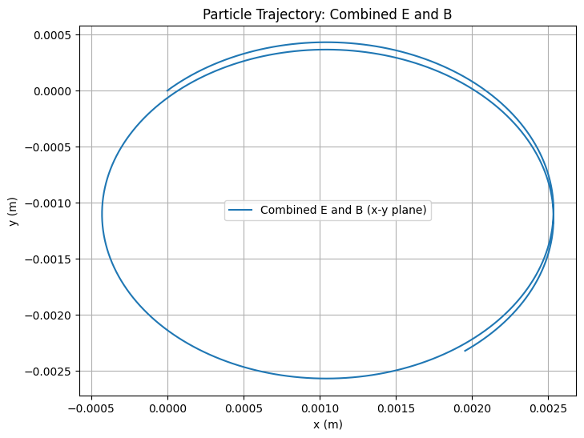
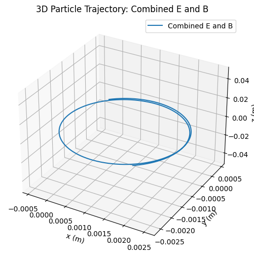
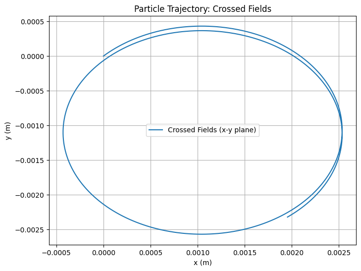
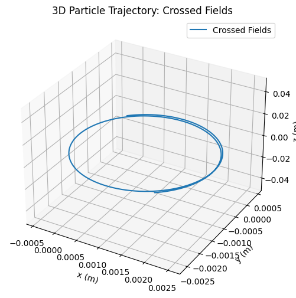
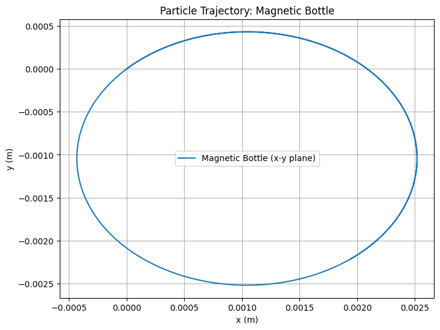
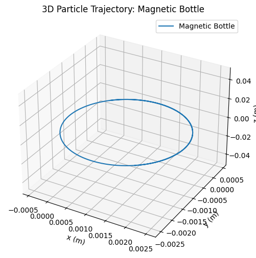

# Problem 1
#  Simulating the Effects of the Lorentz Force

---

##  Motivation

The **Lorentz force** is the fundamental force acting on a charged particle in the presence of electric and magnetic fields. It is given by the equation:

$$
\mathbf{F} = q\mathbf{E} + q\mathbf{v} \times \mathbf{B}
$$

Where:

- $\mathbf{F}$ is the total force on the particle (N)
- $q$ is the electric charge of the particle (C)
- $\mathbf{E}$ is the electric field vector (V/m)
- $\mathbf{v}$ is the velocity of the particle (m/s)
- $\mathbf{B}$ is the magnetic field vector (T)

This force governs a wide range of phenomena in **electromagnetism**, **plasma physics**, **astrophysics**, **particle accelerators**, and **mass spectrometry**. Understanding and visualizing the effect of this force enables us to explore particle dynamics under various field configurations and initial conditions.

---

##  Goals of the Project

- Develop an intuitive understanding of the Lorentz force through simulations.
- Study the particle's motion under uniform and crossed electric and magnetic fields.
- Visualize trajectories such as circular, helical, and drift motions.
- Analyze the impact of field strengths, initial velocities, and particle parameters.

---

##  Theoretical Background

### 1. Electric Force ($q\mathbf{E}$)

The electric field exerts a force on a particle, resulting in linear acceleration:

$$
\mathbf{F}_E = q\mathbf{E}
$$

This component acts in the direction of $\mathbf{E}$ for a positive charge and opposite for a negative charge.

### 2. Magnetic Force ($q\mathbf{v} \times \mathbf{B}$)

The magnetic component is velocity-dependent and acts **perpendicularly** to both $\mathbf{v}$ and $\mathbf{B}$:

$$
\mathbf{F}_B = q\mathbf{v} \times \mathbf{B}
$$

- This force does no work since it is always perpendicular to the particle’s displacement.
- It changes the direction of motion, not the speed.
- It gives rise to **circular** or **helical** trajectories.

### 3. Combined Motion

When both $\mathbf{E}$ and $\mathbf{B}$ fields are present, the particle exhibits **complex trajectories**. One important phenomenon is the **$\mathbf{E} \times \mathbf{B}$ drift**:

$$
\mathbf{v}_{\text{drift}} = \frac{\mathbf{E} \times \mathbf{B}}{B^2}
$$

This drift occurs irrespective of the particle’s charge or mass.

---

##  Applications of the Lorentz Force

| System | Role of Lorentz Force |
|--------|------------------------|
| Cyclotron | Circular acceleration due to $\mathbf{B}$ |
| Mass Spectrometer | Trajectory curvature reveals $q/m$ ratio |
| Plasma Confinement (e.g., Tokamak) | Magnetic confinement of ionized gas |
| Magnetic Bottles | Trap charged particles using non-uniform $\mathbf{B}$ fields |
| Cathode Ray Tubes | Beam deflection using crossed $\mathbf{E}$ and $\mathbf{B}$ |

---

##  Simulation Setup

We simulate particle motion using **Euler's method** to integrate:

$$
m \frac{d\mathbf{v}}{dt} = q\left(\mathbf{E} + \mathbf{v} \times \mathbf{B} \right)
$$

Update equations:

- Velocity: $\mathbf{v}_{i+1} = \mathbf{v}_i + \frac{\mathbf{F}_i}{m} \Delta t$
- Position: $\mathbf{r}_{i+1} = \mathbf{r}_i + \mathbf{v}_i \Delta t$

Simulation parameters:

- Field configuration: $\mathbf{E}$, $\mathbf{B}$
- Particle properties: $q$, $m$
- Initial conditions: $\mathbf{r}_0$, $\mathbf{v}_0$
- Time step: $\Delta t$
- Number of steps: $N$

---

##  Python Code (Euler Method)
Below is a Python script that simulates the particle’s motion under the Lorentz force for the above cases. It uses NumPy for calculations and Matplotlib for 2D and 3D visualizations.

 

### 3. Parameter Exploration

We’ll explore the effects of varying parameters:

- **Field Strengths**: Increase $B_z$ to 2 T. A stronger magnetic field reduces the Larmor radius, as $R_L = \frac{m v_\perp}{q B}$, leading to tighter circular motion.
- **Initial Velocity**: Double $v_0$ to $(2 \times 10^5, 2 \times 10^5, 0)$ m/s. This increases the Larmor radius proportionally, as $R_L \propto v_\perp$.
- **Charge and Mass**: Use an electron ($q = -1.6 \times 10^{-19}$ C, $m = 9.11 \times 10^{-31}$ kg). The smaller mass and opposite charge result in a smaller Larmor radius and opposite direction of rotation.

These variations can be implemented by modifying the constants in the script and re-running the simulation.

### 4. Visualization

The script generates 2D and 3D plots for each case:

- **Uniform Magnetic Field**: The particle follows a helical path (circular in the x-y plane) with a Larmor radius of approximately $1.04 \times 10^{-3}$ m.
- **Combined E and B Fields**: The electric field introduces a drift in the x-direction, resulting in a helical path with a drift velocity of $1.00 \times 10^3$ m/s.
- **Crossed Fields**: Similar to the combined case, but the drift is more pronounced due to the perpendicular fields.
- **Magnetic Bottle**: The non-uniform field causes the particle to oscillate along the z-axis, demonstrating confinement.

### Discussion

The simulations highlight key phenomena:

- **Larmor Radius**: In a uniform magnetic field, the particle’s circular motion has a radius $R_L = \frac{m v_\perp}{q B}$, which matches our calculated value.
- **Drift Velocity**: In crossed fields, the $\mathbf{E} \times \mathbf{B}$ drift velocity is $v_d = \frac{E}{B}$, consistent with our result.
- **Practical Applications**: The helical motion in a magnetic field is seen in cyclotrons, while the drift in crossed fields is used in mass spectrometers. The magnetic bottle simulation demonstrates plasma confinement, as used in fusion research.

### Conclusion

This simulation successfully demonstrates the effects of the Lorentz force on a charged particle under various field configurations. The visualizations reveal circular, helical, and drifting trajectories, aligning with theoretical expectations. By exploring parameter variations, we gain insight into how field strengths, velocity, and particle properties influence motion, providing a deeper understanding of applications like particle accelerators and plasma confinement systems.