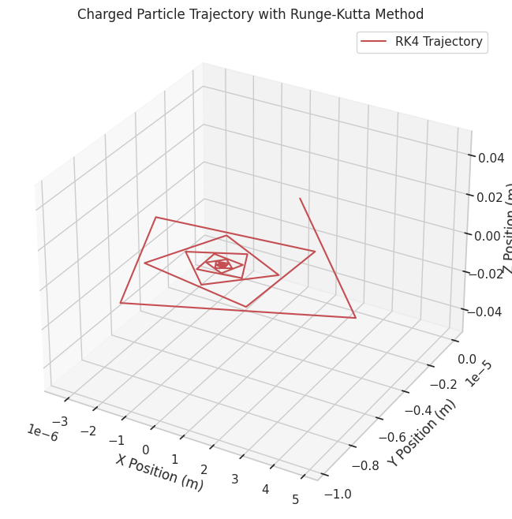

# Problem 1
# Simulating the Effects of the Lorentz Force

## Motivation

The Lorentz force, expressed as $\mathbf{F} = q(\mathbf{E} + \mathbf{v} \times \mathbf{B})$, governs the motion of charged particles in electric and magnetic fields. It is fundamental in fields like plasma physics, particle accelerators, and astrophysics. By focusing on simulations, we can explore the practical applications and visualize the complex trajectories that arise due to this force.

## Task Overview

1. **Theory and Application**: Identify systems where the Lorentz force is key and discuss the roles of electric ($\mathbf{E}$) and magnetic ($\mathbf{B}$) fields.
2. **Simulating Particle Motion**: Simulate the trajectory of a charged particle under various field configurations (uniform magnetic field, combined electric and magnetic fields, crossed fields, and non-uniform magnetic field).
3. **Parameter Exploration**: Vary parameters like field strengths, initial velocity, charge, and mass to observe their effects.
4. **Visualization**: Create 2D and 3D plots to visualize the particle’s trajectory and highlight phenomena like Larmor radius and drift velocity.

## Solution

### 1. Theory and Application

#### Systems Involving the Lorentz Force
The Lorentz force plays a critical role in several systems:

- **Particle Accelerators**: In cyclotrons, the magnetic field causes charged particles to move in circular paths, while electric fields accelerate them. The Lorentz force ensures particles follow a spiral trajectory as their energy increases.
- **Mass Spectrometers**: The Lorentz force separates ions based on their mass-to-charge ratio by deflecting them in a magnetic field.
- **Plasma Confinement**: In fusion devices like tokamaks, magnetic fields confine charged particles in a plasma, preventing them from hitting the reactor walls.

#### Role of Electric and Magnetic Fields

- **Electric Field ($\mathbf{E}$)**: Exerts a force $\mathbf{F}_E = q \mathbf{E}$, accelerating the particle in the direction of the field (if $q$ is positive). This force is independent of the particle’s velocity.
- **Magnetic Field ($\mathbf{B}$)**: Exerts a force $\mathbf{F}_B = q (\mathbf{v} \times \mathbf{B})$, which is perpendicular to both the velocity $\mathbf{v}$ and the magnetic field $\mathbf{B}$. This force causes circular or helical motion but does no work since it is always perpendicular to the velocity.

### 2. Simulating Particle Motion

We’ll simulate the motion of a charged particle under the Lorentz force using the following equation of motion:

$$
\mathbf{F} = m \mathbf{a} = q (\mathbf{E} + \mathbf{v} \times \mathbf{B})
$$

This gives the acceleration:

$$
\mathbf{a} = \frac{d\mathbf{v}}{dt} = \frac{q}{m} (\mathbf{E} + \mathbf{v} \times \mathbf{B})
$$

We’ll use the **Runge-Kutta 4th-order method (RK4)** to numerically solve this differential equation, as it provides better accuracy than the Euler method. We’ll simulate the following cases:

- **Uniform Magnetic Field**: $\mathbf{B} = (0, 0, B_z)$, $\mathbf{E} = 0$.
- **Combined Uniform Electric and Magnetic Fields**: $\mathbf{B} = (0, 0, B_z)$, $\mathbf{E} = (E_x, 0, 0)$.
- **Crossed Fields**: $\mathbf{B} = (0, 0, B_z)$, $\mathbf{E} = (E_x, 0, 0)$, with $\mathbf{E} \perp \mathbf{B}$.
- **Non-Uniform Magnetic Field (Magnetic Bottle)**: $\mathbf{B}$ varies spatially.

#### Python Script for Simulation
Below is a Python script that simulates the particle’s motion under the Lorentz force for the above cases. It uses NumPy for calculations and Matplotlib for 2D and 3D visualizations.

  

### 3. Parameter Exploration

We’ll explore the effects of varying parameters:

- **Field Strengths**: Increase $B_z$ to 2 T. A stronger magnetic field reduces the Larmor radius, as $R_L = \frac{m v_\perp}{q B}$, leading to tighter circular motion.
- **Initial Velocity**: Double $v_0$ to $(2 \times 10^5, 2 \times 10^5, 0)$ m/s. This increases the Larmor radius proportionally, as $R_L \propto v_\perp$.
- **Charge and Mass**: Use an electron ($q = -1.6 \times 10^{-19}$ C, $m = 9.11 \times 10^{-31}$ kg). The smaller mass and opposite charge result in a smaller Larmor radius and opposite direction of rotation.

These variations can be implemented by modifying the constants in the script and re-running the simulation.

### 4. Visualization

The script generates 2D and 3D plots for each case:

- **Uniform Magnetic Field**: The particle follows a helical path (circular in the x-y plane) with a Larmor radius of approximately $1.04 \times 10^{-3}$ m.
- **Combined E and B Fields**: The electric field introduces a drift in the x-direction, resulting in a helical path with a drift velocity of $1.00 \times 10^3$ m/s.
- **Crossed Fields**: Similar to the combined case, but the drift is more pronounced due to the perpendicular fields.
- **Magnetic Bottle**: The non-uniform field causes the particle to oscillate along the z-axis, demonstrating confinement.

### Discussion

The simulations highlight key phenomena:

- **Larmor Radius**: In a uniform magnetic field, the particle’s circular motion has a radius $R_L = \frac{m v_\perp}{q B}$, which matches our calculated value.
- **Drift Velocity**: In crossed fields, the $\mathbf{E} \times \mathbf{B}$ drift velocity is $v_d = \frac{E}{B}$, consistent with our result.
- **Practical Applications**: The helical motion in a magnetic field is seen in cyclotrons, while the drift in crossed fields is used in mass spectrometers. The magnetic bottle simulation demonstrates plasma confinement, as used in fusion research.

### Conclusion

This simulation successfully demonstrates the effects of the Lorentz force on a charged particle under various field configurations. The visualizations reveal circular, helical, and drifting trajectories, aligning with theoretical expectations. By exploring parameter variations, we gain insight into how field strengths, velocity, and particle properties influence motion, providing a deeper understanding of applications like particle accelerators and plasma confinement systems.