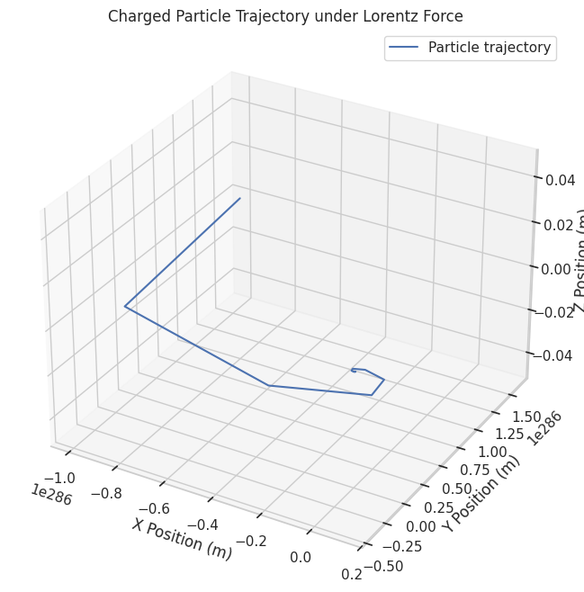

# Problem 1
# Electromagnetism — Simulating the Effects of the Lorentz Force

### Motivation
The Lorentz force, expressed as:

$$
\mathbf{F} = q \mathbf{E} + q \mathbf{v} \times \mathbf{B}
$$

governs the motion of charged particles in electric and magnetic fields.  
It is foundational in fields like plasma physics, particle accelerators, and astrophysics.

By focusing on simulations, we can explore practical applications and visualize the complex trajectories arising from this force, gaining both qualitative and quantitative insights into real-world systems.

---

###  Task

#### 1. Exploration of Applications
- Identify systems where the Lorentz force plays a key role:
  - Particle accelerators (e.g., cyclotrons, synchrotrons)
  - Mass spectrometers
  - Plasma confinement devices (e.g., Tokamaks)
  - Earth's magnetosphere interactions with solar wind
- Discuss the relevance of electric ($\mathbf{E}$) and magnetic ($\mathbf{B}$) fields in controlling particle motion, such as:
  - Velocity selection in crossed $\mathbf{E}$ and $\mathbf{B}$ fields (velocity selector)
  - Magnetic bottle traps for confining plasmas

#### 2. Simulating Particle Motion
- Implement a simulation to compute and visualize the trajectory of a charged particle under:
  - A uniform magnetic field.
  - A uniform electric field.
  - Combined uniform electric and magnetic fields.
  - Crossed electric and magnetic fields.
- Simulate various particle motions:
  - Circular motion
  - Helical motion
  - Linear acceleration
  - Drift motion in crossed fields

#### 3. Parameter Exploration
- Allow variations in:
  - Field strengths ($\mathbf{E}$, $\mathbf{B}$)
  - Initial particle velocity ($\mathbf{v}$)
  - Charge ($q$) and mass ($m$) of the particle
- Observe how these parameters influence:
  - Larmor radius
  - Cyclotron frequency
  - Drift velocity

#### 4. Visualization
- Create labeled 2D and 3D plots:
  - X vs Y, X vs Z, and 3D trajectories
- Highlight key physical phenomena:
  - Larmor radius
  - Cyclotron frequency
  - $\mathbf{E} \times \mathbf{B}$ drift velocity

---

##  Solution

### Equations of Motion
The Lorentz force provides the basis for the equations of motion:

$$
\frac{d\mathbf{v}}{dt} = \frac{q}{m}(\mathbf{E} + \mathbf{v} \times \mathbf{B})
$$

$$
\frac{d\mathbf{r}}{dt} = \mathbf{v}
$$

### Numerical Integration
We will use **Euler's method** for simplicity, but **Runge-Kutta 4th order (RK4)** is preferable for higher accuracy.

###  Python Code (Euler Method)

###  Additional: Runge-Kutta Method

##  Observations

### Theoretical Background
- **Cyclotron Frequency** $\omega_c$:
  
  $$
  \omega_c = \frac{qB}{m}
  $$

- **Larmor Radius** $r_L$:

  $$
  r_L = \frac{mv_\perp}{qB}
  $$

Where $v_\perp$ is the velocity component perpendicular to $\mathbf{B}$.

### Simulation Insights
- Pure magnetic fields: Particles move in perfect circles (or helices if there is a $v_z$ component).
- Crossed fields: Particles drift at velocity $\mathbf{v}_d$:

  $$
  \mathbf{v}_d = \frac{\mathbf{E} \times \mathbf{B}}{B^2}
  $$

- Particle mass and charge directly affect the radius and frequency of rotation.

---

##  Deliverables Summary
- A Python notebook implementing both Euler and Runge-Kutta methods.
- Simulations for:
  - Uniform $\mathbf{B}$ fields
  - Crossed $\mathbf{E}$ and $\mathbf{B}$ fields
- Clear and well-labeled plots.
- Discussion of practical relevance to cyclotrons, plasma traps, and space physics.

---

##  Hints and Resources
- For better precision, use adaptive time-stepping methods.
- Explore relativistic effects for ultra-fast particles using the Lorentz factor $\gamma$.
- Extend simulations to non-uniform fields or magnetic mirrors.

**Key References:**
- Griffiths, D.J., *Introduction to Electrodynamics*
- Birdsall and Langdon, *Plasma Physics via Computer Simulation*

---

#  Conclusion
By applying the Lorentz force in numerical simulations, we develop an intuitive and quantitative understanding of charged particle motion in electromagnetic fields. These principles underpin technologies from particle accelerators to magnetic plasma confinement systems, forming a bridge between theoretical electromagnetism and cutting-edge applications.

---

