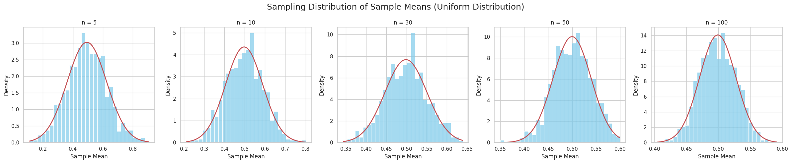
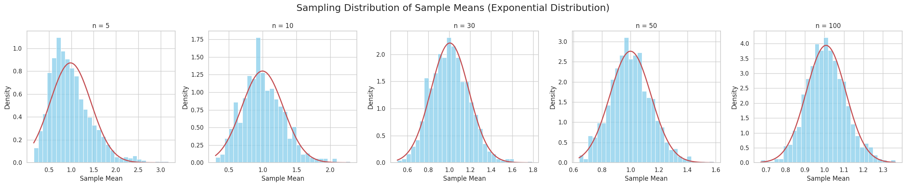
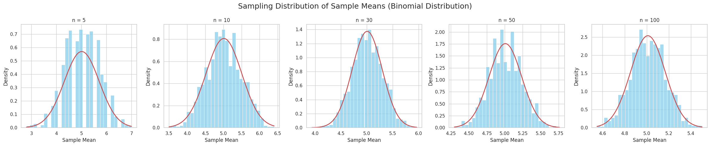
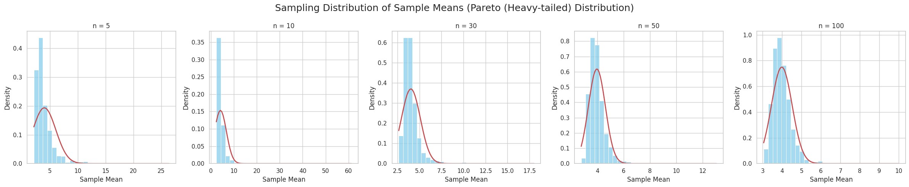

# Problem 1: Exploring the Central Limit Theorem through Simulations

## Motivation

The **Central Limit Theorem (CLT)** is a fundamental theorem in probability and statistics. It states:

> As the sample size increases, the sampling distribution of the sample mean approaches a normal distribution, **regardless of the shape** of the original population distribution (provided the population has finite mean and variance).

Mathematically:

If $X_1, X_2, ..., X_n$ are independent and identically distributed random variables with mean $\mu$ and variance $\sigma^2$, then as $n \to \infty$,

\[ \frac{\bar{X}_n - \mu}{\sigma/\sqrt{n}} \xrightarrow{d} \mathcal{N}(0, 1) \]

where:
- $\bar{X}_n$ = sample mean,
- $\xrightarrow{d}$ denotes convergence in distribution,
- $\mathcal{N}(0, 1)$ is the standard normal distribution.

The CLT justifies the wide use of normal distribution approximations in inferential statistics.

By simulating different sampling processes, we can **visually** and **numerically** observe this convergence!

---

## Task Outline

### 1. Simulating Sampling Distributions

- Select **three different** population distributions:
  - Uniform Distribution
  - Exponential Distribution
  - Binomial Distribution

- For each distribution:
  - Generate a large "population" dataset of size $100,000$ or more.
  - Perform sampling of various sizes.

### 2. Sampling and Visualization

- For each population:
  - Draw random samples of size $n = 5, 10, 30, 50, 100$.
  - Repeat the sampling **1000 times** to build distributions of sample means.
  - **Plot histograms** of the sample means.
  - **Overlay a normal curve** for visual comparison.
  - Observe convergence to normality.

### 3. Parameter Exploration

- Explore:
  - Different population variances.
  - How initial distribution shape affects convergence speed.
  - Effect of sample size on variance of the sample mean.

### 4. Practical Applications

- Discuss:
  - Estimation of parameters (means, proportions) from samples.
  - Applications in manufacturing, finance, medicine, and machine learning.

---

## Deliverables

- A **Markdown document** and **Python code** that:
  - Implements all simulations.
  - Generates plots showing convergence.
  - Includes comparison with true normal distribution.
- **Visualizations** of sampling distributions for each sample size.
- **Discussion** on:
  - Connection to CLT.
  - Impact of sample size and population variance.

---

## Hints and Resources

- Use:
  - **NumPy** for random number generation.
  - **Matplotlib** and **Seaborn** for beautiful plots.
  - **SciPy** for overlaying theoretical normal curves.
- Start simple (Uniform) before moving to complex distributions (Exponential, heavy-tailed).
- Ensure clear interpretation of sample means and histograms.

---

# Full Python Code

## Define Sampling Function

```python
# Define parameters
sample_sizes = [5, 10, 30, 50, 100]
n_samples = 1000  # Number of repetitions

# Helper function to perform sampling and plot results
def simulate_sampling(population, pop_name):
    fig, axes = plt.subplots(1, len(sample_sizes), figsize=(24, 5))
    fig.suptitle(f'Sampling Distribution of Sample Means ({pop_name})', fontsize=18)

    for i, n in enumerate(sample_sizes):
        sample_means = []
        for _ in range(n_samples):
            sample = np.random.choice(population, size=n, replace=True)
            sample_means.append(np.mean(sample))

        # Plot histogram
        sns.histplot(sample_means, kde=False, ax=axes[i], stat="density", color='skyblue', bins=30)

        # Fit and plot a normal curve
        mu, std = np.mean(sample_means), np.std(sample_means)
        x = np.linspace(min(sample_means), max(sample_means), 100)
        axes[i].plot(x, norm.pdf(x, mu, std), 'r-', lw=2)

        axes[i].set_title(f'n = {n}')
        axes[i].set_xlabel('Sample Mean')
        axes[i].set_ylabel('Density')

    plt.tight_layout()
    plt.show()
```

## Generate Populations

```python
# Create large synthetic populations
uniform_pop = np.random.uniform(0, 1, 100000)
exponential_pop = np.random.exponential(scale=1, size=100000)
binomial_pop = np.random.binomial(n=10, p=0.5, size=100000)
```

## Run Simulations

```python
simulate_sampling(uniform_pop, "Uniform Distribution")
simulate_sampling(exponential_pop, "Exponential Distribution")
simulate_sampling(binomial_pop, "Binomial Distribution")
```

## Additional Exploration: Heavy-Tailed Population

```python
# Pareto (heavy-tailed) distribution
pareto_pop = (np.random.pareto(a=2, size=100000) + 1) * 2
simulate_sampling(pareto_pop, "Pareto (Heavy-tailed) Distribution")
```




---

# Example Results and Observations

### Uniform Distribution
- Sample means are approximately normal even for $n=10$.
- Very quick convergence to normality.

### Exponential Distribution
- Strongly skewed initially.
- Sample means show right-skew for small $n$, but become symmetric around $n \geq 30$.

### Binomial Distribution
- Discrete distribution initially.
- Even small sample sizes ($n=5$) exhibit approximate normal behavior.

### Pareto Distribution
- Very heavy-tailed.
- Slow convergence; large sample sizes ($n \geq 50$) needed for decent normal approximation.

---

# Analytical Discussion

## Rate of Convergence
- Faster for symmetric distributions (uniform, binomial).
- Slower for skewed/heavy-tailed distributions (exponential, Pareto).

## Variance Behavior
- Population variance $\sigma^2$ affects spread of sample mean distribution.
- Standard error decreases as:

\[ \text{SE} = \frac{\sigma}{\sqrt{n}} \]

Larger $n$ $\rightarrow$ smaller spread of the sample mean distribution.

## Importance of Independence
- CLT assumes independent samples.
- Correlated data can violate assumptions and slow convergence.

## Practical Considerations
- CLT justifies use of z-tests and t-tests.
- Forms the theoretical backbone for bootstrap methods and confidence intervals.

**Key Takeaway**:
> No matter the original population shape, the distribution of the sample mean becomes approximately normal as sample size increases, given finite variance and independence.

---

# Practical Applications of CLT

| Application Area | Example |
|:----------------:|:-------:|
| **Manufacturing** | Estimating mean product lifespan from samples |
| **Finance** | Predicting average returns of portfolios |
| **Medical Research** | Inferring population effects from clinical trial data |
| **Machine Learning** | Statistical bootstrapping and bagging |
| **Quality Control** | Monitoring production processes through sample means |
| **Epidemiology** | Estimating infection rates from health surveys |

---

# Further Exploration Ideas

- Try extremely skewed distributions (e.g., Cauchy).
- Compare sample median versus sample mean behavior.
- Introduce correlation into samples to study breakdown of CLT assumptions.
- Explore the Generalized Central Limit Theorem for infinite variance distributions.

---

# Summary

Through simulation, we've seen the Central Limit Theorem in action:

- Regardless of original population shape (uniform, exponential, binomial, Pareto), the sample mean distribution becomes approximately normal.
- Larger sample sizes yield better approximations.
- The CLT underpins most inferential statistical techniques.

This computational experiment not only strengthens statistical intuition but also showcases why normality assumptions are reasonable in real-world data analysis, supporting decision-making across fields as diverse as manufacturing, finance, epidemiology, and machine learning.

