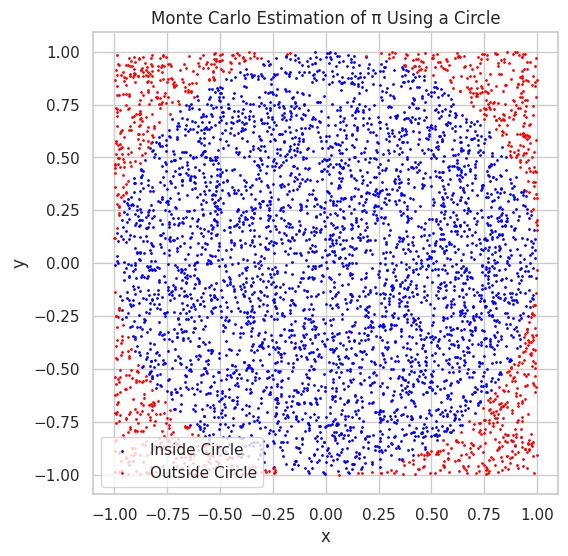
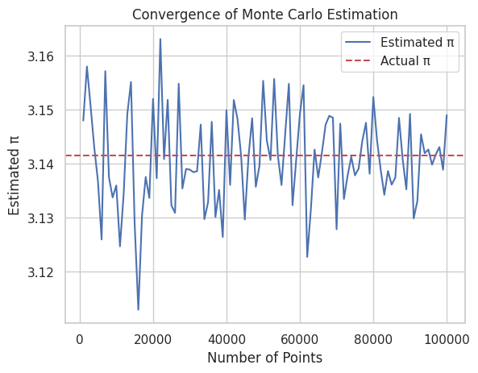
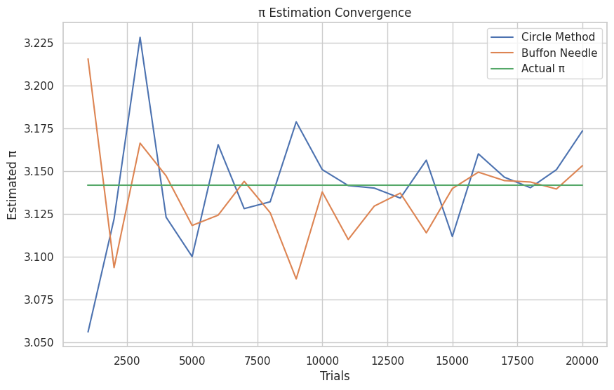

# Problem 2
# Estimating Pi Using Monte Carlo Methods

##  Motivation

Monte Carlo simulations use randomness to solve problems that might be deterministic in principle. One fascinating application is estimating the value of π (pi) — a fundamental mathematical constant — through geometric probability.

This approach is powerful because:
- It visually demonstrates probabilistic thinking.
- It connects concepts from geometry, statistics, and computation.
- It highlights convergence and randomness in numerical simulations.

---

##  Part 1: Estimating π Using a Circle (Geometric Probability)

###  Theoretical Foundation

Imagine a unit circle (radius = 1) inscribed in a square of side length 2. The area of the square is $( 4 )$ and the area of the circle is $( \pi )$. If we randomly throw darts at the square, the probability that a dart lands inside the circle is:

$$
P = \frac{\text{Area of Circle}}{\text{Area of Square}} = \frac{\pi}{4}
$$

Hence, we can estimate π as:

$$
\pi \approx 4 \times \frac{\text{Number of points inside circle}}{\text{Total points}}
$$

###  Simulation in Python

Estimate of π with 100 points: 3.080000

Estimate of π with 1000 points: 3.072000

Estimate of π with 10000 points: 3.157200

Estimate of π with 100000 points: 3.135560

###  Visualization

###  Convergence Analysis

---

##  Part 2: Estimating π Using Buffon’s Needle

###  Theoretical Foundation

Buffon's Needle is a probability experiment where a needle of length $( l )$ is dropped onto a floor with parallel lines spaced distance $( d )$ apart. If $( l \leq d )$, then the probability that the needle crosses a line is:

$$
P = \frac{2l}{d\pi}
$$

Rearranging gives the estimation of π:

$$
\pi \approx \frac{2l \times n}{d \times \text{number of crossings}}
$$

###  Simulation in Python

Estimate of π with 100 throws: 3.571429

Estimate of π with 1000 throws: 3.144654

Estimate of π with 5000 throws: 3.184713

Estimate of π with 10000 throws: 3.133323

###  Advanced Visualization (Optional Concept)

Due to complexity in drawing angles and positions of each needle, this is usually left as conceptual or approximated with overlays.

---

##  Comparison and Convergence

---

##  Summary of Findings

- Circle-based method is simpler and converges faster with fewer points.
- Buffon’s Needle is a clever historical method but requires more trials for good accuracy.
- Visualization and coding help in understanding random sampling, geometry, and convergence.

---

##  Hints & Best Practices

- Use `numpy` for efficient random sampling.
- For Buffon’s Needle, make sure the length of the needle does not exceed the line spacing.
- Start with small iterations to test and validate logic, then scale up.
