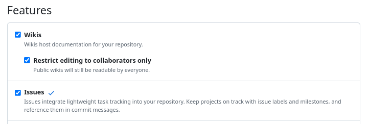

# Physics 2025 - Solutions

## How to use this repository

Below are the steps you need to follow:

1. Create a GitHub account if you don’t have one.
2. Fork this repository to your account.  
   
3. Enable the **Issues** tab:
    - Go to the `Settings` tab and check the **Issues** option.  
      
4. Add your professor as a collaborator:
    - Go to the `Settings` tab and add their GitHub username in the **Collaborators** section.  
      

**Source Code & WWW**

You can find the source code in the following repository:  
[GitHub repo](https://github.com/dchorazkiewicz/solutions_repo)
[WWW](https://github.com/dchorazkiewicz/solutions_repo)
